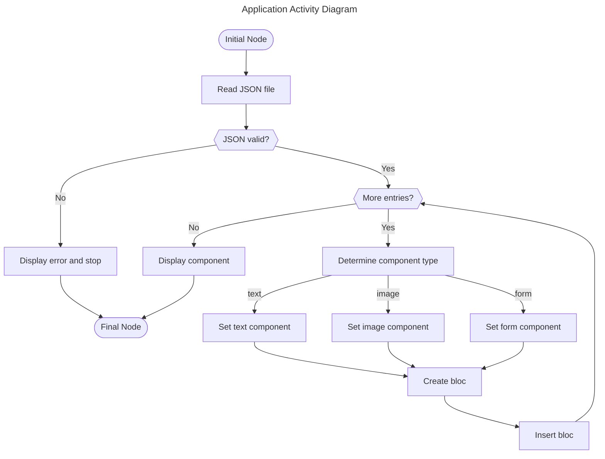
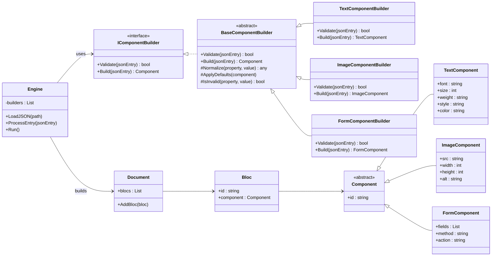
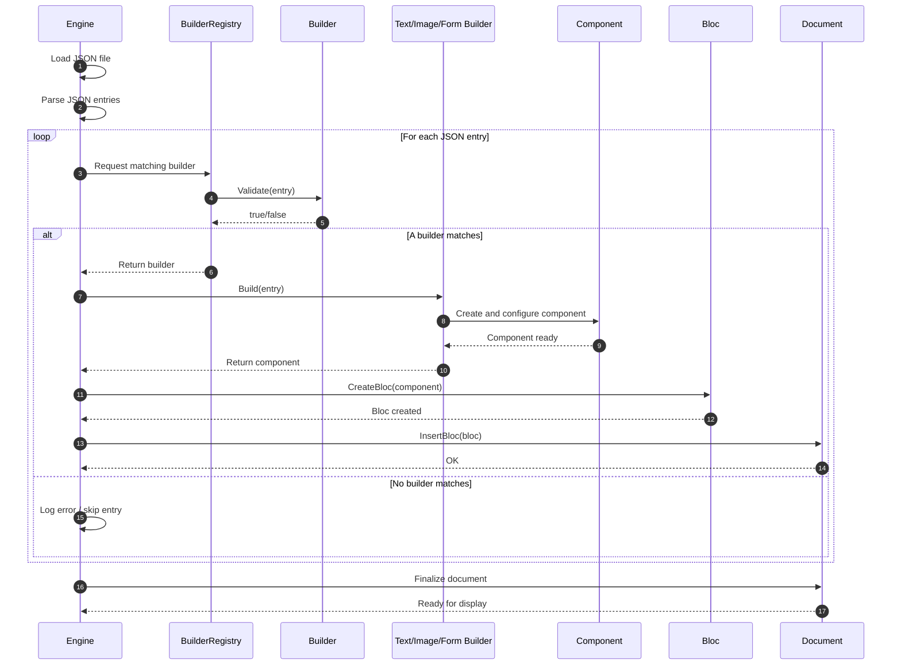

# Application Activity Diagram

```mermaid
---
title: Application Activity Diagram
---
flowchart TD

    %% Start / End
    start([Initial Node])
    END([Final Node])

    %% Activities
    A1[Read JSON file]
    A2{{JSON valid?}}
    A3[Display error and stop]

    A4{{More entries?}}
    A5[Determine component type]

    A6[Set text component]
    A7[Set image component]
    A8[Set form component]

    A9[Create bloc]
    A10[Insert bloc]
    A11[Display component]

    %% Flow
    start --> A1 --> A2
    A2 -->|No| A3 --> END
    A2 -->|Yes| A4

    A4 -->|No| A11 --> END
    A4 -->|Yes| A5

    A5 -->|text| A6 --> A9
    A5 -->|image| A7 --> A9
    A5 -->|form| A8 --> A9

    A9 --> A10 --> A4
```
---

# UML CLass Diagram

```mermaid
classDiagram
    direction LR

    %% ===== Interfaces =====
    class IComponentBuilder {
        <<interface>>
        +Validate(jsonEntry) bool
        +Build(jsonEntry) Component
    }

    %% ===== Base class =====
    class BaseComponentBuilder {
        <<abstract>>
        +Validate(jsonEntry) bool
        +Build(jsonEntry) Component
        #Normalize(property, value) any
        #ApplyDefaults(component)
        #IsInvalid(property, value) bool
    }

    IComponentBuilder <|.. BaseComponentBuilder

    %% ===== Concrete Builders =====
    class TextComponentBuilder {
        +Validate(jsonEntry) bool
        +Build(jsonEntry) TextComponent
    }

    class ImageComponentBuilder {
        +Validate(jsonEntry) bool
        +Build(jsonEntry) ImageComponent
    }

    class FormComponentBuilder {
        +Validate(jsonEntry) bool
        +Build(jsonEntry) FormComponent
    }

    BaseComponentBuilder <|-- TextComponentBuilder
    BaseComponentBuilder <|-- ImageComponentBuilder
    BaseComponentBuilder <|-- FormComponentBuilder

    %% ===== Components =====
    class Component {
        <<abstract>>
        +id : string
    }

    class TextComponent {
        +font : string
        +size : int
        +weight : string
        +style : string
        +color : string
    }

    class ImageComponent {
        +src : string
        +width : int
        +height : int
        +alt : string
    }

    class FormComponent {
        +fields : List<Field>
        +method : string
        +action : string
    }

    Component <|-- TextComponent
    Component <|-- ImageComponent
    Component <|-- FormComponent

    %% ===== Bloc system =====
    class Bloc {
        +id : string
        +component : Component
    }

    class Document {
        +blocs : List<Bloc>
        +AddBloc(bloc)
    }

    Bloc --> Component
    Document --> Bloc

    %% ===== Engine =====
    class Engine {
        -builders : List<IComponentBuilder>
        +LoadJSON(path)
        +ProcessEntry(jsonEntry)
        +Run()
    }

    Engine --> IComponentBuilder : uses
    Engine --> Document : builds
 
```
---

# UML Sequence Diagram

```mermaid
sequenceDiagram
    autonumber

    participant Engine
    participant BuilderRegistry
    participant IComponentBuilder as Builder
    participant ConcreteBuilder as Text/Image/Form Builder
    participant Component
    participant Bloc
    participant Document

    Engine->>Engine: Load JSON file
    Engine->>Engine: Parse JSON entries

    loop For each JSON entry
        Engine->>BuilderRegistry: Request matching builder
        BuilderRegistry->>IComponentBuilder: Validate(entry)
        IComponentBuilder-->>BuilderRegistry: true/false

        alt A builder matches
            BuilderRegistry-->>Engine: Return builder

            Engine->>ConcreteBuilder: Build(entry)
            ConcreteBuilder->>Component: Create and configure component
            Component-->>ConcreteBuilder: Component ready
            ConcreteBuilder-->>Engine: Return component

            Engine->>Bloc: CreateBloc(component)
            Bloc-->>Engine: Bloc created

            Engine->>Document: InsertBloc(bloc)
            Document-->>Engine: OK
        else No builder matches
            Engine->>Engine: Log error / skip entry
        end
    end

    Engine->>Document: Finalize document
    Document-->>Engine: Ready for display

```